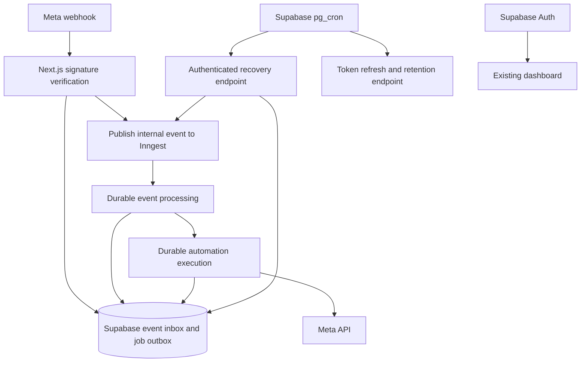

# open-autoDM implementation plan

Date: 3 October 2026. Status: proposed, for owner review. No application changes or deployments have been performed.

## Objective and fixed decisions

Adapt the existing open-autoDM application for personal Instagram automation. Keep its campaign builder, comment/DM/story triggers, Supabase PostgreSQL, Supabase Auth, token encryption, and supported Meta API integration. Deploy Next.js to Vercel. Use Inngest for durable event/job execution and Supabase pg_cron for recovery and maintenance.

Fork: https://github.com/sakethrambilla/open-autodm
Upstream: https://github.com/harshithgangone/open-autodm
Checkout: /Users/sakethram/Documents/personal/projects/open-autodm

Do not add Clerk, Neon, Redis, QStash, a persistent worker, AI replies, billing, or a replacement UI. Do not upgrade Next.js solely for this integration. Retain the MIT license and upstream attribution. Existing multi-account features can remain; no new tenancy features are requested.

This document replaces the earlier greenfield architecture proposal. It is intentionally one reviewable file in docs/ as requested.

## Findings from the actual repository

- Next.js 15.5, React 19, Supabase SDK and Zod are present. Inngest and automated test scripts are absent.
- `src/app/api/webhook/route.ts` verifies signatures but calls event processing through `after()` after returning success. Events can be lost before persistence.
- `src/lib/automation/processWebhook.ts` matches triggers and writes `auto_dm` or `follow_up` jobs. Preserve this behavior, including session/postback handling.
- `src/lib/automation/queue.ts` returns null for both duplicate inserts and database errors. Several updates ignore returned errors.
- `src/lib/automation/engine.ts` combines claims, sends, and retries; generic errors are treated as transient.
- The queue migration reclaims every processing job older than ten minutes. A crashed send can therefore be retried even when Meta accepted it.
- `src/lib/automation/processJob.ts` can send several messages and public replies in one flow. Wrapping the entire function in one durable step would repeat earlier sends after a partial failure.
- `src/app/api/cron/process-jobs/route.ts` sends jobs directly and performs refresh/cleanup on every invocation. The setup wizard currently generates a once-per-minute schedule.
- `vercel.json` also registers a daily cron. Remove that duplicate scheduler when Supabase cron becomes authoritative.

## Architecture and responsibility boundaries

Supabase is the durable source of truth. Inngest runs code served by the Vercel application; it does not eliminate Vercel invocation or compute usage. Cron publishes/reconciles work and maintains data; it never sends Instagram messages. Only Inngest functions execute sends.

### Webhook receipt

1. Read the raw bytes, enforce a size bound, and verify the documented Meta signature with the configured app secret.
2. Parse and validate the supported envelope, check connected account identities, and split supported individual events.
3. Persist each event using a stable unique key scoped to its Instagram account. Store supported normalized data plus the bounded source payload needed by existing processing.
4. Acknowledge only after durable persistence. Return 5xx on storage failure; duplicate delivery is a successful no-op.
5. Publish internal events with only database IDs and account IDs. Await a bounded publication attempt. Publication failure after storage is recorded and still returns 200; recovery publishes later.
6. Do not match campaigns, call Meta, or rely on post-response execution in the receiver.

DM dedupe uses provider message IDs. Comment dedupe distinguishes event kind and comment ID; unsupported edits must not silently become new initial replies. Postbacks use provider IDs when available and a carefully scoped deterministic fallback verified against actual payloads. Keep a fixture for each supported event shape. Unsupported signed notifications are acknowledged without sending.

### Durable event processing

An `instagram/webhook.received` function loads the event by ID and runs existing matching/session logic. Event replays may repeat matching, so all job creation and session changes must be idempotent. Persist candidate jobs before publishing `instagram/job.ready`. Recovered event publication and job publication use separate generation-aware keys; short-lived Inngest deduplication is supplementary to database state.

Refactor existing ingestion to accept one normalized event and return explicit created/existing job IDs. Duplicate creation must distinguish success from database failure. Restrict one initial private reply across overlapping campaigns for a single account/comment.

### Durable job processing

An `instagram/job.ready` function loads and atomically claims one job by ID. Use a versioned lease with owner and expiry. Database guards reject duplicate runs. Inngest concurrency is one active step per account; database account/send guards remain necessary because concurrency settings do not serialize an entire workflow while it sleeps.

Extract the existing flow into preparation, individual outbound actions, and finalization. Each public reply, opening DM, and subsequent response gets a stable action key and a persisted action row. No giant step containing multiple API sends.

Before each action, reload active account/rule state, session validity, recipient eligibility, and rate budget. Use durable sleeps for delay/backoff instead of blocking timers. Long delays must not leave a claimed database lease expiring without an explicit suspended state.

### Send state and the ambiguous-outcome rule

Action states: pending, dispatching, accepted, skipped, failed, uncertain. Before the external call, persist dispatch intent. On success store provider message ID. Explicit retryable rejections may return the action to pending with a scheduled retry. Permission, policy, invalid-recipient and expired-window errors terminate or pause appropriately.

Timeout/reset after dispatch, or crash while dispatching, becomes uncertain. Do not automatically resend. Inngest durable steps do not make Meta requests exactly once. An accepted action is never repeated even if job finalization or step-result storage fails. Multi-message flows resume from their first unsent action; ambiguous actions halt the remaining sequence.

Catch/classify errors inside send steps. Persist uncertain outcomes before reporting a terminal result; if the persistence itself fails, recovery must recognize the existing dispatch marker. Final failure hooks persist unresolved workflow failures without restarting the flow.

## Supabase schema changes

Create an additive migration; never edit historical migrations:

- `webhook_inbox`: account ID, stable event key, normalized/source payload, state, receipt/occurrence timestamps, publication generation, publication lease, next publication time, last error. Unique account/event key.
- Extend `job_queue`: workflow/run reference, publication generation/state, lease owner/expiry, next retry, explicit skipped/uncertain states. Preserve existing payload and job types.
- `outbound_actions`: unique job/action key, action kind, recipient reference, immutable message snapshot, state, provider message ID, dispatch timestamp, error classification and attempt count.
- Atomic RPCs for inbox/outbox publication claims, single-job claims, action dispatch transitions, and stale lease recovery. Revoke execution from PUBLIC/anon/authenticated and grant only to service_role. RLS alone does not protect SECURITY DEFINER functions.
- Index due publication/retry timestamps and account activity. Keep message text and tokens out of Inngest event payloads.

The stale-claim recovery RPC may return unsent work to pending. It must convert dispatching actions to uncertain, never indiscriminately repeat sends. Check all database operation errors. Cleanup retains unresolved work and enough non-content dedupe tombstones to cover verified provider redelivery windows.

## Scheduling without consuming Inngest's allowance on empty polls

Keep Supabase pg_cron and pg_net:

| Schedule | Endpoint | Work |
| --- | --- | --- |
| Every five minutes | POST `/api/cron/process-jobs` | Reconcile overdue workflow state and publish up to 100 eligible inbox/job IDs |
| Hourly | POST `/api/cron/maintenance` | Refresh eligible expiring tokens with a lock |
| Daily | POST `/api/cron/maintenance` with a validated cleanup mode | Prune content, finished records, and cron history in bounded batches |

A stored retry due time is authoritative; the active workflow normally sleeps until it is due. Cron does not republish merely because a workflow is sleeping. Republish only confirmed failed publication or interrupted work after its lease/heartbeat deadline. Recovering already-dispatched work follows the ambiguous-outcome rule.

If the Inngest API accepts an event but the publication result is lost, duplicate publication is possible and must be harmless. Persist generation/run association and use database action guards. Do not rely on Inngest's 24-hour idempotency period for permanent recovery.

Supabase cron calls the Vercel endpoints directly. Empty recovery checks create no Inngest runs. Five-minute polling produces about 8,640 Vercel requests per 30 days, not 8,640 Inngest workflows. Recovery can be delayed by five minutes; successful webhook publication normally starts immediately.

Use Authorization headers only; remove query-string secret acceptance. Store the scheduler secret in Supabase Vault and reference it from cron SQL rather than embedding it in stored SQL. Setup output contains instructions and references, never the actual secret. Replace named schedules idempotently so running setup twice cannot create duplicate schedules. Keep pg_cron/pg_net retention bounded.

## Environment and deployment

Keep existing Supabase public URL/anon key, server-only service-role key, token encryption key, CRON_SECRET, and canonical public app URL. Add server-only INNGEST_EVENT_KEY and INNGEST_SIGNING_KEY. Select and pin the SDK version against its current documentation; the current v4 function interface differs from older examples.

Create `/api/inngest` using the SDK Next.js serve adapter and register both functions. Validate signing in production. Owner routes remain Supabase-session authenticated; cron uses its scheduler secret; Meta uses webhook HMAC; Inngest uses its own signing mechanism. Do not confuse these credentials or apply dashboard auth to public signed callbacks.

Use a separate Supabase test project, Inngest environment, and Vercel preview credentials. Preview instances must not subscribe to the production Instagram account. Set a canonical production URL rather than deriving OAuth redirects from untrusted forwarded headers.

Production rollout: apply additive migrations, deploy with sends paused, register Inngest functions, remove legacy direct-drain paths, replace cron schedules, run signed fixture tests, connect a tester account, then prove one real audience interaction. Preserve existing paused work during rollback. Rollback may require disabling cron/Inngest sending before reverting code; an old worker cannot safely interpret new states.

## File-by-file plan

| Existing file | Change |
| --- | --- |
| `package.json`, `package-lock.json` | Add pinned Inngest SDK and focused test tooling; preserve npm workflow |
| `src/lib/env.ts`, `.env.example` | Validate Inngest secrets, canonical URL and dry-run switch |
| `src/lib/types.ts` | Inbox, action and extended job types |
| `src/app/api/webhook/route.ts` | Persist before acknowledging; publish IDs; remove after-based processing |
| `src/lib/automation/processWebhook.ts` | Idempotent normalized-event handling and explicit job results |
| `src/lib/automation/queue.ts` | Single-job/publication claims, checked writes, recovery state transitions |
| `src/lib/automation/processJob.ts` | Extract preparation/actions/finalization; preserve existing flow behavior |
| `src/lib/automation/engine.ts` | Remove legacy batch direct sending; share outcome classification only |
| `src/lib/instagram/api.ts`, `src/lib/instagram/errors.ts` | Distinguish explicit rejection from unknown outcome; bounded requests |
| `src/app/api/cron/process-jobs/route.ts` | Publication/recovery only; no token refresh or direct sends |
| `src/app/api/setup/route.ts` | Vault-backed, idempotent cron setup output |
| `src/components/debug/AutomationDebugPanel.tsx` | Expose delayed, failed and uncertain outcomes without raw secrets/content |
| `vercel.json` | Remove duplicate Vercel cron |

New implementation files:

- `supabase/migrations/20261003000001_durable_processing.sql`: additive schema/RPCs, privileges and indexes.
- `src/lib/automation/inbox.ts`: durable ingress and generation-aware publication.
- `src/lib/automation/actions.ts`: per-action guards and send outcome persistence.
- `src/lib/inngest/client.ts`: server-side client and typed events.
- `src/lib/inngest/functions.ts`: event processing and job execution functions.
- `src/lib/automation/maintenance.ts`: locked refresh and bounded cleanup shared by cron handlers.
- `src/app/api/inngest/route.ts`: signed SDK serving endpoint.
- `src/app/api/cron/maintenance/route.ts`: authenticated maintenance entry point.
- `vitest.config.ts`, `tests/webhook.test.ts`, `tests/processing.test.ts`, `tests/recovery.integration.test.ts`: focused reliability verification.

Update comments on touched behavior, including engine/cron docstrings. Retain functional directives and license comments. No README rewrite or unrelated UI changes.

## Implementation tasks

The four tasks below are ordered; implementation is not authorized by creating this document. No commits are created now.

### Task 1 — Durable receipt and database guards

Files: migration, types, inbox.ts, queue.ts, webhook route, processWebhook.ts, test configuration and webhook tests.

1. Add Vitest with `test` and `test:integration` npm scripts; isolate database integration tests behind a TEST_SUPABASE_URL/service key pair that must differ from production.
2. Add inbox/outbox/actions schema and service-only RPC permissions.
3. Test invalid HMAC, duplicate receipt, account scope and database failure.
4. Implement bounded persistence before HTTP 200; publication remains a recoverable interface for Task 2.
5. Replace swallowed enqueue/update failures with explicit duplicate results or thrown persistence errors.
6. Test replay of session/postback processing and account/comment reply uniqueness.

Verification: `npm run test -- tests/webhook.test.ts`, `npm run test:integration`, `npm run typecheck`. All exit zero. Valid receipt survives a process stop after HTTP acknowledgement; storage failure returns 5xx; invalid signature creates no inbox row. Inspect RPC grants as anon/authenticated and verify execution denied.

### Task 2 — Inngest orchestration and safe sends

Depends on Task 1. Files: package/lockfile, environment, Inngest modules/route, processJob.ts, actions.ts, engine.ts, Instagram client/errors and processing tests.

1. Pin SDK and add production-signed serving route; run local Inngest development server against the application.
2. Implement webhook-event workflow and job publication with stable IDs/generations.
3. Extract preparation and individual public/DM send actions from existing monolithic flow; snapshot each planned response.
4. Add atomic action guards and policy checks immediately before each send.
5. Implement durable delay/retry and stop blind replay after ambiguous dispatch.
6. Implement per-account concurrency and failure finalization. Disable every legacy direct sending entry point.
7. Test a partial three-action flow: first accepted, second explicit rejection, then resume without repeating first; timeout on second halts third as uncertain.

Verification: `npm run test -- tests/processing.test.ts`, `npm run typecheck`, `npm run build`. All exit zero. With a fake Meta transport, duplicate Inngest events dispatch once, terminal errors never retry, and account pause before dispatch prevents sends. Run with Inngest's local server and verify completed steps are reused. No test calls real Instagram.

### Task 3 — Supabase cron recovery and maintenance

Depends on Task 2. Files: recovery/maintenance routes, queue/inbox/maintenance modules, setup route, vercel.json and recovery integration tests.

1. Make existing cron endpoint publish bounded due work, never execute sends.
2. Add separate locked token maintenance and daily cleanup mode.
3. Generate idempotent Vault-backed schedules; remove query-secret authentication and Vercel cron.
4. Implement stale pre-send recovery versus uncertain dispatched-action classification.
5. Bound publication retries, prevent empty polls from creating Inngest runs, and preserve sleeping active workflows.
6. Test publish failure, accepted-but-unrecorded publication, concurrent cron calls, expired claims and maintenance lock contention.

Verification: `npm run test:integration`, `npm run test`, `npm run typecheck`. All exit zero. Run setup twice and inspect `cron.job`: exactly one schedule per name. Stop publication, ingest a webhook, restore publication and invoke recovery: the stored event completes without a second response. Empty cron invocation emits zero Inngest events; unauthenticated invocation returns 401.

### Task 4 — Operational visibility and staged Vercel release

Depends on Task 3. Files: debug panel, related existing job-status readers/types, and scoped test fixtures.

1. Surface uncertain/failed/delayed states; show provider acceptance accurately rather than claiming recipient delivery.
2. Run invite-only Supabase login checks and verify signed endpoints are isolated from dashboard sessions.
3. Verify connection/subscription setup using an ordinary audience account; resolve Meta review/access requirements if needed.
4. Apply production migration and deploy paused; register functions and cron only after dry-run tests pass.
5. Test one real keyword DM, one comment private reply, supported story/postback flow and duplicate event replay.
6. Test pause, token revocation, retention and the rollback procedure before broadening campaigns.

Verification: `npm run test`, `npm run test:integration`, `npm run typecheck`, `npm run build` exit zero. Manual production checks record one accepted response for each eligible action, zero response for paused/unsupported events, and actionable failed/uncertain states. Production deployments happen only when requested.

## Acceptance criteria mapping

| Criterion | Task |
| --- | --- |
| HTTP 200 implies supported event is durably stored; invalid HMAC has no effects | 1 |
| Duplicate receipt, session replay and concurrent handlers do not create repeat reply actions | 1, 2 |
| Inngest alone executes sends; cron only republishes/maintains | 2, 3 |
| Accepted message is never intentionally replayed after later action failure | 2 |
| Ambiguous network result stays uncertain without automatic resend | 2, 3 |
| Delays do not occupy blocking serverless timers; policy rechecked at dispatch | 2 |
| Lost publication and pre-send crashed jobs recover; sleeping runs are not duplicated | 3 |
| Empty scheduled polls use zero Inngest executions | 3 |
| Existing Supabase Auth, campaigns and supported Meta flows remain usable | 2, 4 |
| No production tokens/content enter preview, logs or event payloads | 1–4 |
| Real audience permission test succeeds before automation launch | 4 |

## Budget and operational limits

Target incremental spend is $0 within existing quotas, not guaranteed zero cost. Keep Supabase storage and debug retention bounded and monitor free-project pausing. Vercel Hobby permits non-commercial personal use; use the owner's paid plan if automation supports a business.

Inngest Free currently includes 50,000 monthly executions, counting the run plus steps. Estimate a single-message event as two runs (event processing plus job processing) and roughly three total steps: approximately five executions before publication/recovery/retries. Thus 5,000 single-message triggers is approximately 25,000 executions; 10,000 reaches roughly 50,000 before overhead. Multi-action campaigns cost more. Confirm actual SDK step/event accounting with a measured sample before setting campaign budgets.

Supabase cron handles empty polling without creating Inngest workflows. Inngest free-quota exhaustion must leave stored work visible and pause dispatch rather than delete it. Five-minute recovery creates Vercel requests and Supabase queries even when idle; measure those separately. Alerts should flag publication backlog, uncertain actions, failed refresh, and quota headroom, not assume every quiet account is broken.

Meta messaging windows, private-reply restrictions, supported follower flags and endpoint rate limits must be checked for the selected integration. The upstream's fixed rate constants are application defaults, not verified universal Meta guarantees. Preserve conservative limits until current documentation/account tests establish the correct endpoint-specific behavior. Do not broaden follow gates or introduce unsupported outreach.

## Review and rollout boundaries

This work authorizes the fork, checkout and this plan only. No credentials, cloud resources, migrations, commits, pushes of the plan or deployment are performed now. The GitHub fork contains upstream code; this document remains local until a push is requested.

The earlier fork under saketh-turgon-ai remains untouched. The intended local origin is sakethrambilla/open-autodm and upstream remains harshithgangone/open-autodm.

## Primary implementation references

- Inngest current TypeScript function reference: https://www.inngest.com/docs/reference/typescript/v4/functions/create
- Inngest serving/signing reference: https://www.inngest.com/docs/reference/typescript/v4/serve
- Inngest execution pricing: https://www.inngest.com/pricing
- Supabase Cron: https://supabase.com/docs/guides/cron
- Supabase platform pricing: https://supabase.com/pricing
- Vercel plans: https://vercel.com/pricing
- Meta Instagram integration: https://developers.facebook.com/docs/instagram-platform/instagram-api-with-instagram-login/

Plan review checked durable acknowledgement, publication recovery, multi-send replay, privilege boundaries, single retry ownership and idle-poll execution cost. Automated application verification is part of future implementation, not a claim that tests already pass.
